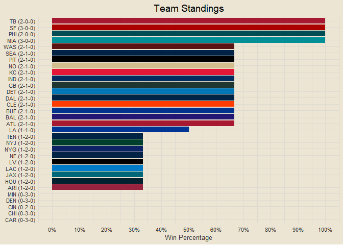
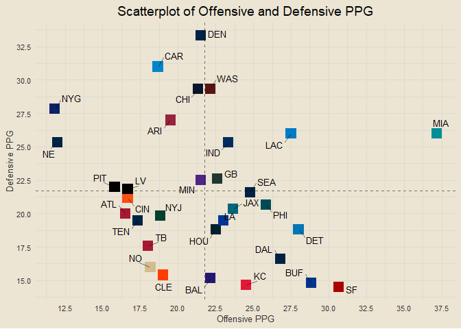
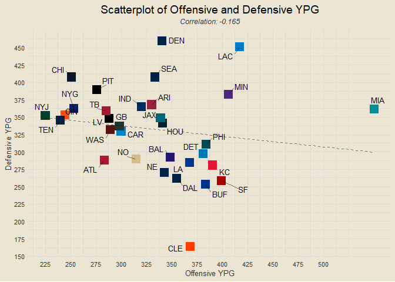
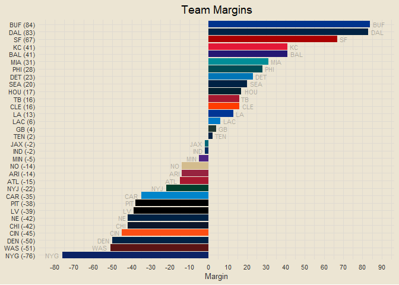
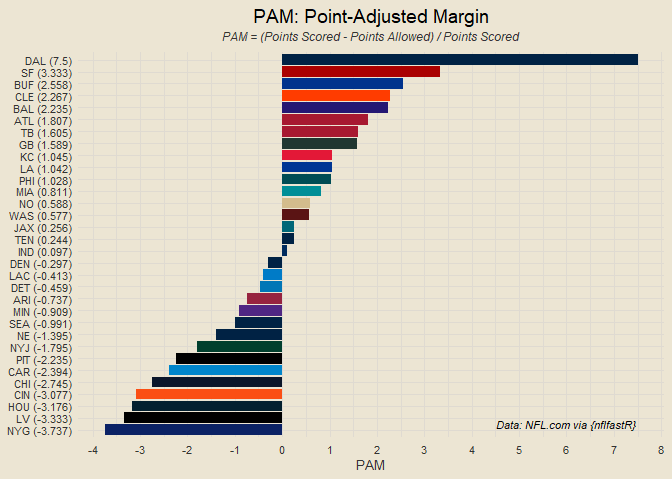
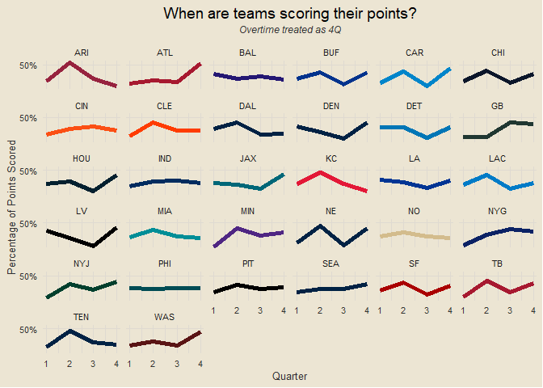

### Contents

- [Team Standings](#team-standings)
- [Offensive and Defensive PPG](#offensive-and-defensive-ppg)
- [Offensive and Defensive YPG](#offensive-and-defensive-ypg)
- [Team Margins](#team-margins)
- [Point-Adjusted Margins](#point-adjusted-margins)
- [Quarter-Based Scoring Trends](#quarter-based-scoring-trends)

------------------------------------------------------------------------

### Team Standings

<!-- -->

------------------------------------------------------------------------

### Offensive and Defensive PPG

<!-- -->

------------------------------------------------------------------------

### Offensive and Defensive YPG

<!-- -->

------------------------------------------------------------------------

### Team Margins

<!-- -->

------------------------------------------------------------------------

### Point-Adjusted Margins

<!-- -->

------------------------------------------------------------------------

### Quarter-Based Scoring Trends

<!-- -->
