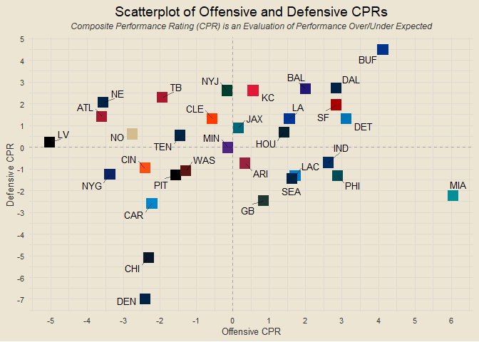
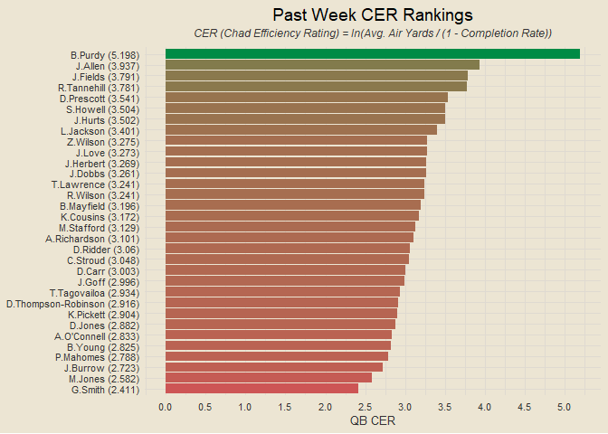
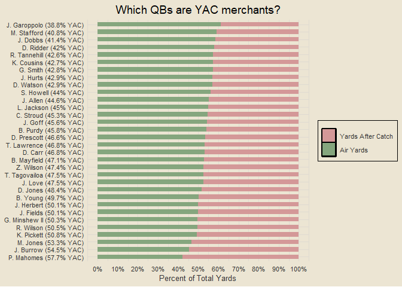
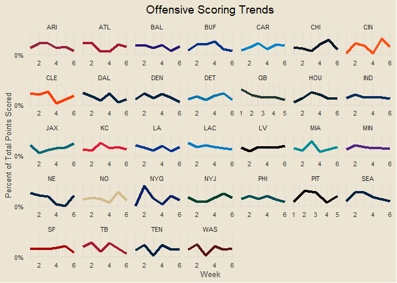
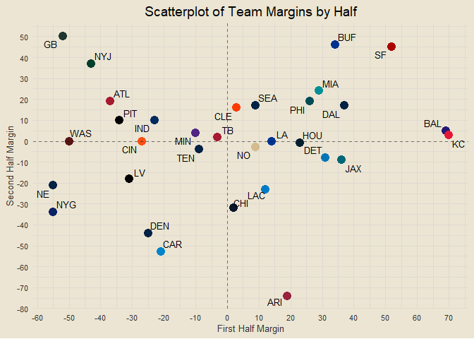
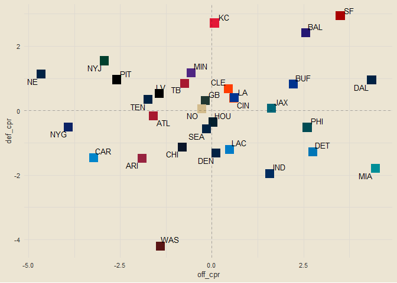

<!-- ##### *Formatting is off right now. Will be adjusting soon :)* -->

### Contents

- [Team Standings](#team-standings)
- [Offensive and Defensive PPG](#offensive-and-defensive-ppg)
- [Offensive and Defensive YPG](#offensive-and-defensive-ypg)
- [Team Margins](#team-margins)
- [Point-Adjusted Margins](#point-adjusted-margins)
- [Quarter-Based Scoring Trends](#quarter-based-scoring-trends)
- [Offensive and Defensive CPR](#offensive-and-defensive-cpr)
- [Weekly QB CER](#weekly-qb-cer)
- [QB Air Yards v YAC](#qb-air-yards-v-yac)
- [Modeling](#modeling)

------------------------------------------------------------------------

### Team Standings

<!-- -->

------------------------------------------------------------------------

### Offensive and Defensive PPG

<!-- -->

------------------------------------------------------------------------

### Offensive and Defensive YPG

<!-- -->

------------------------------------------------------------------------

### Team Margins

<!-- -->

------------------------------------------------------------------------

### Point-Adjusted Margins

<!-- -->

------------------------------------------------------------------------

### Quarter-Based Scoring Trends

<!-- -->

------------------------------------------------------------------------

### Offensive and Defensive CPR

<!-- -->

##### Five Best Total CPRs

1.  SF: 6.446
2.  DAL: 5.305
3.  BAL: 4.967
4.  BUF: 3.038
5.  KC: 2.783

##### Five Worst Total CPRs

1.  WAS: -5.608
2.  CAR: -4.696
3.  NYG: -4.431
4.  NE: -3.532
5.  ARI: -3.377

------------------------------------------------------------------------

### Weekly QB CER

<!-- -->

------------------------------------------------------------------------

### QB Air Yards v YAC

<!-- -->

------------------------------------------------------------------------

### Modeling

First draft basic logistic regression accuracy: 66.98%

##### *This Week’s Predictions*

- NYG @ PHI: PHI def. NYG (0.872)
- NE @ DEN: DEN def. NE (0.772)
- LV @ KC: KC def. LV (0.751)
- BAL @ SF: SF def. BAL (0.737)
- ARI @ CHI: CHI def. ARI (0.735)
- GB @ CAR: GB def. CAR (0.705)
- CIN @ PIT: CIN def. PIT (0.683)
- DAL @ MIA: MIA def. DAL (0.667)
- BUF @ LAC: BUF def. LAC (0.645)
- SEA @ TEN: TEN def. SEA (0.613)
- NO @ LA: LA def. NO (0.58)
- CLE @ HOU: HOU def. CLE (0.563)
- DET @ MIN: DET def. MIN (0.557)
- JAX @ TB: JAX def. TB (0.525)
  <!-- - WAS @ NYJ: NYJ def. WAS (0.521) -->
  <!-- - IND @ ATL: IND def. ATL (0.516) -->

<!-- -->

### Team Margins by Half

<!-- -->

    ##    team            class
    ## 1   ARI       always bad
    ## 2   ATL second half team
    ## 3   BAL      always good
    ## 4   BUF      always good
    ## 5   CAR       always bad
    ## 6   CHI       always bad
    ## 7   CIN second half team
    ## 8   CLE      always good
    ## 9   DAL      always good
    ## 10  DEN       always bad
    ## 11  DET  first half team
    ## 12   GB second half team
    ## 13  HOU  first half team
    ## 14  IND  first half team
    ## 15  JAX  first half team
    ## 16   KC  first half team
    ## 17   LA second half team
    ## 18  LAC       always bad
    ## 19   LV  first half team
    ## 20  MIA      always good
    ## 21  MIN  first half team
    ## 22   NE       always bad
    ## 23   NO second half team
    ## 24  NYG       always bad
    ## 25  NYJ second half team
    ## 26  PHI second half team
    ## 27  PIT second half team
    ## 28  SEA       always bad
    ## 29   SF      always good
    ## 30   TB       always bad
    ## 31  TEN  first half team
    ## 32  WAS       always bad

``` r
data.frame(team = all_teams) |>
  mutate(off_cpr = sapply(team, get_off_cpr),
         def_cpr = sapply(team, get_def_cpr)) |>
  ggplot(aes(off_cpr, def_cpr)) +
  geom_point(aes(col = team), size = 5, shape = "square", show.legend = F) +
  ggrepel::geom_text_repel(aes(label = team), size = 3.5, max.overlaps = 32) +
  scale_color_manual(values = team_hex) +
  geom_hline(yintercept = 0, linetype = "dashed", alpha = 0.25) +
  geom_vline(xintercept = 0, linetype = "dashed", alpha = 0.25)
```

<!-- -->

``` r
data.frame(team = all_teams) |>
  mutate(off_cpr = sapply(team, get_off_cpr),
         def_cpr = sapply(team, get_def_cpr),
         class = case_when(off_cpr > 0 & def_cpr > 0 ~ "good overall",
                           off_cpr > 0 & def_cpr <= 0 ~ "good offense, bad defense",
                           off_cpr <= 0 & def_cpr > 0 ~ "bad offense, good defense",
                           off_cpr <= 0 & def_cpr <= 0 ~ "bad overall")) |>
  count(class)
```

    ##                       class n
    ## 1 bad offense, good defense 9
    ## 2               bad overall 7
    ## 3 good offense, bad defense 7
    ## 4              good overall 9
