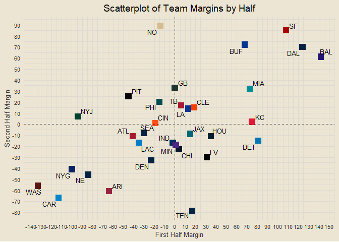

<!-- ##### *Formatting is off right now. Will be adjusting soon :)* -->

### Contents

- [Team Standings](#team-standings)
- [Offensive and Defensive PPG](#offensive-and-defensive-ppg)
- [Offensive and Defensive YPG](#offensive-and-defensive-ypg)
- [Team Margins](#team-margins)
- [Point-Adjusted Margins](#point-adjusted-margins)
- [Quarter-Based Scoring Trends](#quarter-based-scoring-trends)
- [Offensive and Defensive CPR](#offensive-and-defensive-cpr)
- [Weekly QB CER](#weekly-qb-cer)
- [QB Air Yards v YAC](#qb-air-yards-v-yac)
- [Modeling](#modeling)

------------------------------------------------------------------------

### Team Standings

<!-- -->

------------------------------------------------------------------------

### Offensive and Defensive PPG

<!-- -->

------------------------------------------------------------------------

### Offensive and Defensive YPG

<!-- -->

------------------------------------------------------------------------

### Team Margins

<!-- -->

------------------------------------------------------------------------

### Point-Adjusted Margins

<!-- -->

------------------------------------------------------------------------

### Quarter-Based Scoring Trends

<!-- -->

------------------------------------------------------------------------

### Offensive and Defensive CPR

<!-- -->

##### Five Best Total CPRs

1.  BAL: 6.837
2.  SF: 5.708
3.  DAL: 4.201
4.  BUF: 3.192
5.  MIA: 2.519

##### Five Worst Total CPRs

1.  WAS: -5.23
2.  CAR: -4.726
3.  NYG: -4.633
4.  NE: -3.213
5.  ARI: -2.978

------------------------------------------------------------------------

### Weekly QB CER

<!-- -->

------------------------------------------------------------------------

### QB Air Yards v YAC

<!-- -->

------------------------------------------------------------------------

### Modeling

First draft basic logistic regression accuracy: 64.29%

##### *This Week’s Predictions*

- PIT @ BAL: BAL def. PIT (0.929)
- LA @ SF: SF def. LA (0.867)
- DAL @ WAS: DAL def. WAS (0.866)
- BUF @ MIA: MIA def. BUF (0.774)
- MIN @ DET: DET def. MIN (0.728)
- PHI @ NYG: PHI def. NYG (0.711)
- SEA @ ARI: SEA def. ARI (0.694)
- ATL @ NO: NO def. ATL (0.654)
- CLE @ CIN: CLE def. CIN (0.645)
- TB @ CAR: TB def. CAR (0.641)
- NYJ @ NE: NE def. NYJ (0.639)
- JAX @ TEN: JAX def. TEN (0.637)
- CHI @ GB: GB def. CHI (0.628)
- KC @ LAC: KC def. LAC (0.621) <!-- - DEN @ LV: LV def. DEN (0.533) -->
  <!-- - HOU @ IND: IND def. HOU (0.531) -->

<!-- -->

### Team Margins by Half

<!-- -->
