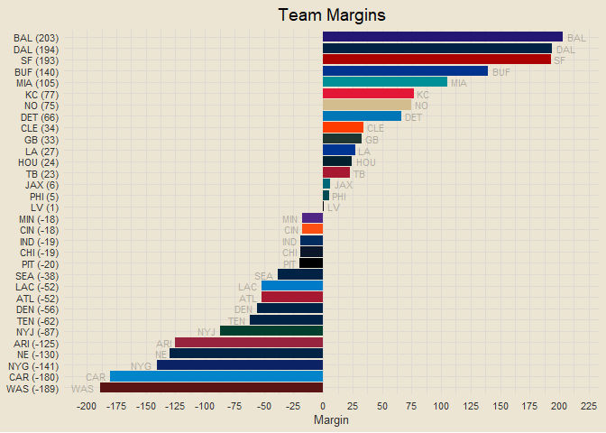

### Contents

- [Team Standings](#team-standings)
- [Offensive and Defensive PPG](#offensive-and-defensive-ppg)
- [Offensive and Defensive YPG](#offensive-and-defensive-ypg)
- [Team Margins](#team-margins)
- [Point-Adjusted Margins](#point-adjusted-margins)
- [Quarter-Based Scoring Trends](#quarter-based-scoring-trends)
- [Offensive and Defensive CPR](#offensive-and-defensive-cpr)
- [Modeling](#modeling)

------------------------------------------------------------------------

### Team Standings

<!-- -->

------------------------------------------------------------------------

### Offensive and Defensive PPG

<!-- -->

------------------------------------------------------------------------

### Offensive and Defensive YPG

<!-- -->

------------------------------------------------------------------------

### Team Margins

<!-- -->

------------------------------------------------------------------------

### Point-Adjusted Margins

<!-- -->

------------------------------------------------------------------------

### Quarter-Based Scoring Trends

<!-- -->

------------------------------------------------------------------------

### Offensive and Defensive CPR

<!-- -->

##### Five Best Total CPRs

1.  BUF: 8.594
2.  DAL: 5.646
3.  SF: 4.865
4.  BAL: 4.688
5.  MIA: 3.812

##### Five Worst Total CPRs

1.  DEN: -9.406
2.  CHI: -7.406
3.  CAR: -5.48
4.  LV: -4.812
5.  NYG: -3.499

------------------------------------------------------------------------

### Modeling

First draft basic logistic regression accuracy: 77.78%

##### *This Week’s Predictions*

- SEA @ NYG: SEA def. NYG (1)
- DEN @ CHI: DEN def. CHI (0.988)
- NE @ DAL: DAL def. NE (0.969)
- ARI @ SF: SF def. ARI (0.951)
- WAS @ PHI: PHI def. WAS (0.859)
- MIA @ BUF: BUF def. MIA (0.845)
- PIT @ HOU: HOU def. PIT (0.835)
- CIN @ TEN: TEN def. CIN (0.814)
- LV @ LAC: LAC def. LV (0.78)
- MIN @ CAR: MIN def. CAR (0.768)
- ATL @ JAX: JAX def. ATL (0.706)
- DET @ GB: DET def. GB (0.682)
- LA @ IND: LA def. IND (0.675)
- BAL @ CLE: BAL def. CLE (0.657)
- KC @ NYJ: KC def. NYJ (0.649)
- TB @ NO: NO def. TB (0.581)

``` r
# Install and load the XGBoost package
# install.packages("xgboost")
library(xgboost)
```

    ## 
    ## Attaching package: 'xgboost'

    ## The following object is masked from 'package:dplyr':
    ## 
    ##     slice

``` r
# Prepare your data
dtrain <- xgb.DMatrix(data = as.matrix(modeling_df[, c("home_pam", "home_avg_margin", "home_ppg",
                                                       "home_papg", "away_pam", "away_avg_margin",
                                                       "away_ppg", "away_papg")]),
                      label = modeling_df$home_win)

# Define hyperparameters
params <- list(
  objective = "binary:logistic",  # Binary classification
  eval_metric = "logloss"         # Log loss as evaluation metric
)

# Train the XGBoost model
xgb_model <- xgboost(data = dtrain, params = params, nrounds = 100)
```

    ## [1]  train-logloss:0.561380 
    ## [2]  train-logloss:0.476716 
    ## [3]  train-logloss:0.425181 
    ## [4]  train-logloss:0.384272 
    ## [5]  train-logloss:0.342676 
    ## [6]  train-logloss:0.307226 
    ## [7]  train-logloss:0.285712 
    ## [8]  train-logloss:0.261494 
    ## [9]  train-logloss:0.243481 
    ## [10] train-logloss:0.229627 
    ## [11] train-logloss:0.218004 
    ## [12] train-logloss:0.208078 
    ## [13] train-logloss:0.199478 
    ## [14] train-logloss:0.189404 
    ## [15] train-logloss:0.184335 
    ## [16] train-logloss:0.178529 
    ## [17] train-logloss:0.174703 
    ## [18] train-logloss:0.168312 
    ## [19] train-logloss:0.162815 
    ## [20] train-logloss:0.159939 
    ## [21] train-logloss:0.154617 
    ## [22] train-logloss:0.151850 
    ## [23] train-logloss:0.146207 
    ## [24] train-logloss:0.143799 
    ## [25] train-logloss:0.140372 
    ## [26] train-logloss:0.137409 
    ## [27] train-logloss:0.135371 
    ## [28] train-logloss:0.132847 
    ## [29] train-logloss:0.130319 
    ## [30] train-logloss:0.128477 
    ## [31] train-logloss:0.125206 
    ## [32] train-logloss:0.121679 
    ## [33] train-logloss:0.120041 
    ## [34] train-logloss:0.118199 
    ## [35] train-logloss:0.115846 
    ## [36] train-logloss:0.112667 
    ## [37] train-logloss:0.111653 
    ## [38] train-logloss:0.109198 
    ## [39] train-logloss:0.107358 
    ## [40] train-logloss:0.105577 
    ## [41] train-logloss:0.103317 
    ## [42] train-logloss:0.101659 
    ## [43] train-logloss:0.100945 
    ## [44] train-logloss:0.099046 
    ## [45] train-logloss:0.097100 
    ## [46] train-logloss:0.096333 
    ## [47] train-logloss:0.095886 
    ## [48] train-logloss:0.094127 
    ## [49] train-logloss:0.093381 
    ## [50] train-logloss:0.092790 
    ## [51] train-logloss:0.091858 
    ## [52] train-logloss:0.091380 
    ## [53] train-logloss:0.090785 
    ## [54] train-logloss:0.090414 
    ## [55] train-logloss:0.090003 
    ## [56] train-logloss:0.089673 
    ## [57] train-logloss:0.089340 
    ## [58] train-logloss:0.088957 
    ## [59] train-logloss:0.088699 
    ## [60] train-logloss:0.088213 
    ## [61] train-logloss:0.087859 
    ## [62] train-logloss:0.087565 
    ## [63] train-logloss:0.086667 
    ## [64] train-logloss:0.086137 
    ## [65] train-logloss:0.085872 
    ## [66] train-logloss:0.085406 
    ## [67] train-logloss:0.085176 
    ## [68] train-logloss:0.084680 
    ## [69] train-logloss:0.084373 
    ## [70] train-logloss:0.083979 
    ## [71] train-logloss:0.083218 
    ## [72] train-logloss:0.082769 
    ## [73] train-logloss:0.082499 
    ## [74] train-logloss:0.082088 
    ## [75] train-logloss:0.081852 
    ## [76] train-logloss:0.081425 
    ## [77] train-logloss:0.080930 
    ## [78] train-logloss:0.080503 
    ## [79] train-logloss:0.079824 
    ## [80] train-logloss:0.079430 
    ## [81] train-logloss:0.079226 
    ## [82] train-logloss:0.078954 
    ## [83] train-logloss:0.078704 
    ## [84] train-logloss:0.078393 
    ## [85] train-logloss:0.078133 
    ## [86] train-logloss:0.077503 
    ## [87] train-logloss:0.077170 
    ## [88] train-logloss:0.076755 
    ## [89] train-logloss:0.076338 
    ## [90] train-logloss:0.075982 
    ## [91] train-logloss:0.075815 
    ## [92] train-logloss:0.075035 
    ## [93] train-logloss:0.074918 
    ## [94] train-logloss:0.074566 
    ## [95] train-logloss:0.074153 
    ## [96] train-logloss:0.074019 
    ## [97] train-logloss:0.073933 
    ## [98] train-logloss:0.073649 
    ## [99] train-logloss:0.073372 
    ## [100]    train-logloss:0.073238

``` r
# Make predictions
# Assuming you have a new dataset called new_data
dtest <- xgb.DMatrix(data = as.matrix(modeling_df[, c("home_pam", "home_avg_margin", "home_ppg", "home_papg", "away_pam", "away_avg_margin", "away_ppg", "away_papg")]))
predictions <- predict(xgb_model, dtest)

# Evaluate the model as needed
modeling_df |>
  select(home_win) |>
  mutate(pred_prob = predictions,
         pred_hw = ifelse(pred_prob >= 0.5, 1, 0)) |>
  count(home_win == pred_hw)
```

    ## # A tibble: 1 × 2
    ##   `home_win == pred_hw`     n
    ##   <lgl>                 <int>
    ## 1 TRUE                     63
