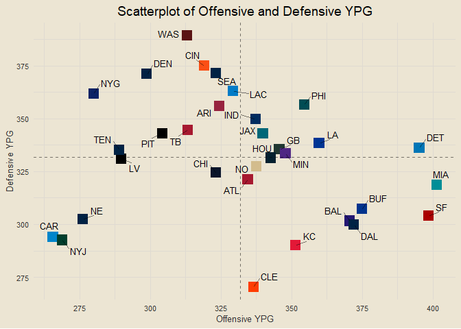

### Contents

- [Team Standings](#team-standings)
- [Offensive and Defensive PPG](#offensive-and-defensive-ppg)
- [Offensive and Defensive YPG](#offensive-and-defensive-ypg)
- [Team Margins](#team-margins)
- [Point-Adjusted Margins](#point-adjusted-margins)
- [Quarter-Based Scoring Trends](#quarter-based-scoring-trends)
- [Offensive and Defensive CPR](#offensive-and-defensive-cpr)
- [Modeling](#modeling)

------------------------------------------------------------------------

### Team Standings

<!-- -->

------------------------------------------------------------------------

### Offensive and Defensive PPG

<!-- -->

------------------------------------------------------------------------

### Offensive and Defensive YPG

<!-- -->

------------------------------------------------------------------------

### Team Margins

<!-- -->

------------------------------------------------------------------------

### Point-Adjusted Margins

<!-- -->

------------------------------------------------------------------------

### Quarter-Based Scoring Trends

<!-- -->

------------------------------------------------------------------------

### Offensive and Defensive CPR

<!-- -->

##### Five Best Total CPRs

1.  MIA: 6.445
2.  BUF: 4.945
3.  SF: 4.555
4.  DAL: 4.167
5.  CLE: 3.668

##### Five Worst Total CPRs

1.  DEN: -8.89
2.  CHI: -6.778
3.  LV: -5.944
4.  CAR: -4.334
5.  WAS: -4.222

------------------------------------------------------------------------

### Modeling

- First draft basic logistic regression accuracy: 79.17%
