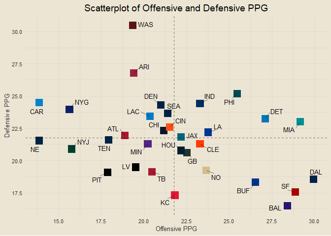
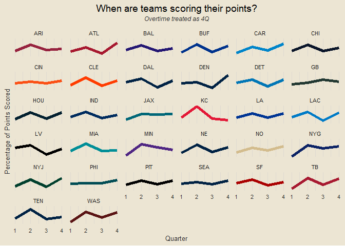

<!-- ##### *Formatting is off right now. Will be adjusting soon :)* -->

### Contents

- [Team Standings](#team-standings)
- [Offensive and Defensive PPG](#offensive-and-defensive-ppg)
- [Offensive and Defensive YPG](#offensive-and-defensive-ypg)
- [Team Margins](#team-margins)
- [Point-Adjusted Margins](#point-adjusted-margins)
- [Quarter-Based Scoring Trends](#quarter-based-scoring-trends)
- [Offensive and Defensive CPR](#offensive-and-defensive-cpr)
- [Weekly QB CER](#weekly-qb-cer)
- [QB Air Yards v YAC](#qb-air-yards-v-yac)
- [Modeling](#modeling)

------------------------------------------------------------------------

### Team Standings

<!-- -->

------------------------------------------------------------------------

### Offensive and Defensive PPG

<!-- -->

------------------------------------------------------------------------

### Offensive and Defensive YPG

<!-- -->

------------------------------------------------------------------------

### Team Margins

<!-- -->

------------------------------------------------------------------------

### Point-Adjusted Margins

<!-- -->

------------------------------------------------------------------------

### Quarter-Based Scoring Trends

<!-- -->

------------------------------------------------------------------------

### Offensive and Defensive CPR

<!-- -->

##### Five Best Total CPRs

1.  BAL: 6.813
2.  SF: 5.648
3.  DAL: 4.183
4.  BUF: 3.199
5.  MIA: 2.538

##### Five Worst Total CPRs

1.  WAS: -5.219
2.  CAR: -4.738
3.  NYG: -4.599
4.  NE: -3.175
5.  ARI: -2.982

------------------------------------------------------------------------

### Weekly QB CER

<!-- -->

------------------------------------------------------------------------

### QB Air Yards v YAC

<!-- -->

------------------------------------------------------------------------

### Modeling

First draft basic logistic regression accuracy: 66.41%

##### *This Week’s Predictions*

- PIT @ BAL: BAL def. PIT (0.905)
- DAL @ WAS: DAL def. WAS (0.869)
- LA @ SF: SF def. LA (0.863)
- MIN @ DET: DET def. MIN (0.735)
- BUF @ MIA: MIA def. BUF (0.724)
- PHI @ NYG: PHI def. NYG (0.712)
- TB @ CAR: TB def. CAR (0.699)
- JAX @ TEN: JAX def. TEN (0.667)
- CHI @ GB: GB def. CHI (0.644)
- ATL @ NO: NO def. ATL (0.64)
- KC @ LAC: KC def. LAC (0.635)
- CLE @ CIN: CLE def. CIN (0.612)
- SEA @ ARI: SEA def. ARI (0.61)
- NYJ @ NE: NE def. NYJ (0.598) <!-- - DEN @ LV: LV def. DEN (0.554) -->
  <!-- - HOU @ IND: IND def. HOU (0.515) -->

<!-- -->

### Team Margins by Half

<!-- -->

``` r
season_pbp |>
  filter(str_detect(desc, "J.Fields")) |>
  filter(down == 3 | down == 4) |>
  mutate(first = ifelse(yards_gained >= ydstogo, 1, 0)) |>
  summarise(avg_ytg = round(mean(ydstogo), 1),
            avg_yds = round(mean(yards_gained), 1),
            pct = round(mean(first) * 100, 2))
```

    ## # A tibble: 1 × 3
    ##   avg_ytg avg_yds   pct
    ##     <dbl>   <dbl> <dbl>
    ## 1     7.6     5.9  38.9

``` r
# ydstogo, yards_gained, shotgun, qb_dropback, qb_scramble, pass_length, pass_location, air_yards, yards_after_catch
```
