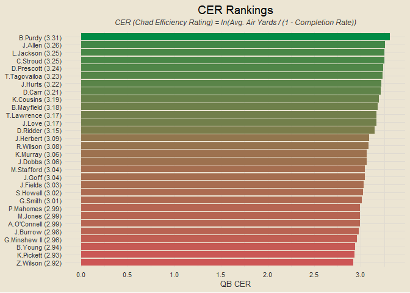

##### *Formatting is off right now. Will be adjusting soon :)*

### Contents

- [Team Standings](#team-standings)
- [Offensive and Defensive PPG](#offensive-and-defensive-ppg)
- [Offensive and Defensive YPG](#offensive-and-defensive-ypg)
- [Team Margins](#team-margins)
- [Point-Adjusted Margins](#point-adjusted-margins)
- [Quarter-Based Scoring Trends](#quarter-based-scoring-trends)
- [Offensive and Defensive CPR](#offensive-and-defensive-cpr)
- [Weekly QB CER](#weekly-qb-cer)
- [QB Air Yards v YAC](#qb-air-yards-v-yac)
- [Modeling](#modeling)

------------------------------------------------------------------------

### Team Standings

<!-- -->

------------------------------------------------------------------------

### Offensive and Defensive PPG

<!-- -->

------------------------------------------------------------------------

### Offensive and Defensive YPG

<!-- -->

------------------------------------------------------------------------

### Team Margins

<!-- -->

------------------------------------------------------------------------

### Point-Adjusted Margins

<!-- -->

------------------------------------------------------------------------

### Quarter-Based Scoring Trends

<!-- -->

------------------------------------------------------------------------

### Offensive and Defensive CPR

<!-- -->

##### Five Best Total CPRs

1.  SF: 6.95
2.  BUF: 5.764
3.  DET: 4.383
4.  KC: 4.14
5.  JAX: 3.332

##### Five Worst Total CPRs

1.  DEN: -5.945
2.  NE: -4.889
3.  CHI: -4.814
4.  WAS: -4.556
5.  CAR: -4.4

------------------------------------------------------------------------

### Weekly QB CER

<!-- -->

------------------------------------------------------------------------

### QB Air Yards v YAC

<!-- -->

------------------------------------------------------------------------

### Modeling

First draft basic logistic regression accuracy: 69.89%

##### *This Week’s Predictions*

- GB @ DEN: GB def. DEN (0.982)
- SF @ MIN: SF def. MIN (0.891)
- LV @ CHI: LV def. CHI (0.881)
- BUF @ NE: BUF def. NE (0.862)
- MIA @ PHI: MIA def. PHI (0.788)
- PIT @ LA: LA def. PIT (0.773)
- ARI @ SEA: SEA def. ARI (0.747)
- ATL @ TB: TB def. ATL (0.738)
- CLE @ IND: CLE def. IND (0.713)
- WAS @ NYG: WAS def. NYG (0.698)
- LAC @ KC: KC def. LAC (0.69)
- DET @ BAL: DET def. BAL (0.599)
- JAX @ NO: JAX def. NO (0.516)
- NA
- NA <!-- - NA -->

``` r
# team pts scored each week slugs
end_games
```

    ## # A tibble: 93 × 13
    ##    game_id   date        week away_team away_score home_score home_team win_team
    ##    <chr>     <date>     <dbl> <chr>          <dbl>      <dbl> <chr>     <chr>   
    ##  1 2023_01_… 2023-09-10     1 ARI               16         20 WAS       WAS     
    ##  2 2023_01_… 2023-09-11     1 BUF               16         22 NYJ       NYJ     
    ##  3 2023_01_… 2023-09-10     1 CAR               10         24 ATL       ATL     
    ##  4 2023_01_… 2023-09-10     1 CIN                3         24 CLE       CLE     
    ##  5 2023_01_… 2023-09-10     1 DAL               40          0 NYG       DAL     
    ##  6 2023_01_… 2023-09-07     1 DET               21         20 KC        DET     
    ##  7 2023_01_… 2023-09-10     1 GB                38         20 CHI       GB      
    ##  8 2023_01_… 2023-09-10     1 HOU                9         25 BAL       BAL     
    ##  9 2023_01_… 2023-09-10     1 JAX               31         21 IND       JAX     
    ## 10 2023_01_… 2023-09-10     1 LA                30         13 SEA       LA      
    ## # ℹ 83 more rows
    ## # ℹ 5 more variables: win_score <dbl>, lose_team <chr>, lose_score <dbl>,
    ## #   game_margin <dbl>, total_points <dbl>

``` r
get_week_pts_scored = function(team, wk) {
  x = end_games |> filter((home_team == team | away_team == team) & week == wk)
  if (nrow(x) == 0) return(NA)
  if (x$home_team == team) score = x$home_score else score = x$away_score
  return(score)
}

weekly_scored = data.frame()

for (i in 1:length(all_teams)) {
  for (j in 1:max(end_games$week)) {
    x = data.frame(team = all_teams[i], week = j)
    weekly_scored = rbind(weekly_scored, x)
  }
}

weekly_scored |>
  rowwise() |>
  mutate(week_scored = get_week_pts_scored(team, week)) |>
  ungroup() |>
  na.omit() |>
  mutate(total_scored = sapply(team, get_pts_scored),
         pct = week_scored / total_scored) |>
  ggplot(aes(week, pct)) +
  geom_line(aes(col = team), linewidth = 1.5, show.legend = F) +
  scale_color_manual(values = team_hex) +
  facet_wrap(vars(team), scales = "free_x", nrow = 5) +
  scale_y_continuous(breaks = seq(0, 1, by = 0.5), labels = scales::percent) +
  labs(x = "Week", y = "Percent of Total Points Scored",
       title = "Offensive Scoring Trends")
```

<!-- -->

### Team Margins by Half

<!-- -->
