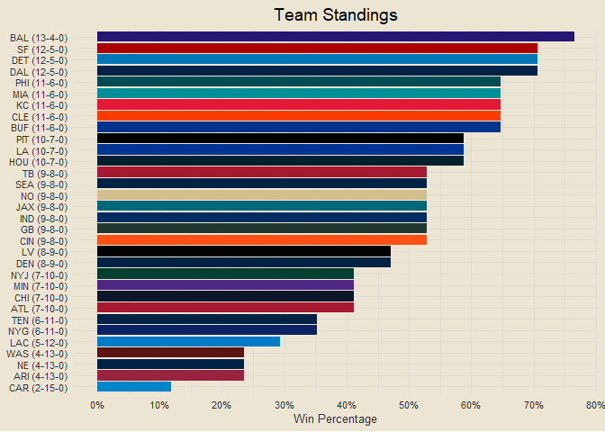
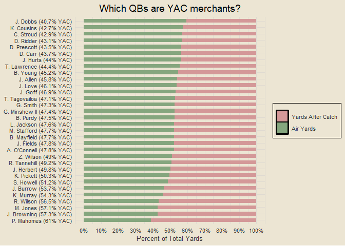
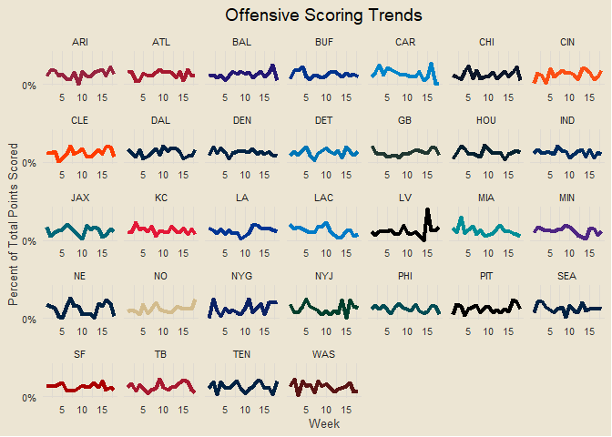

##### *Formatting is off right now. Will be adjusting soon :)*

### Contents

- [Team Standings](#team-standings)
- [Offensive and Defensive PPG](#offensive-and-defensive-ppg)
- [Offensive and Defensive YPG](#offensive-and-defensive-ypg)
- [Team Margins](#team-margins)
- [Point-Adjusted Margins](#point-adjusted-margins)
- [Quarter-Based Scoring Trends](#quarter-based-scoring-trends)
- [Offensive and Defensive CPR](#offensive-and-defensive-cpr)
- [Weekly QB CER](#weekly-qb-cer)
- [QB Air Yards v YAC](#qb-air-yards-v-yac)
- [Modeling](#modeling)

------------------------------------------------------------------------

### Team Standings

<!-- -->

------------------------------------------------------------------------

### Offensive and Defensive PPG

<!-- -->

------------------------------------------------------------------------

### Offensive and Defensive YPG

<!-- -->

------------------------------------------------------------------------

### Team Margins

<!-- -->

------------------------------------------------------------------------

### Point-Adjusted Margins

<!-- -->

------------------------------------------------------------------------

### Quarter-Based Scoring Trends

<!-- -->

------------------------------------------------------------------------

### Offensive and Defensive CPR

<!-- -->

##### Five Best Total CPRs

1.  BAL: 4.486
2.  SF: 4.105
3.  DAL: 3.968
4.  BUF: 3.755
5.  KC: 3.105

##### Five Worst Total CPRs

1.  LV: -4.753
2.  WAS: -4.25
3.  NYG: -3.946
4.  CHI: -3.879
5.  CAR: -3.659

------------------------------------------------------------------------

### Weekly QB CER

<!-- -->

------------------------------------------------------------------------

### QB Air Yards v YAC

<!-- -->

------------------------------------------------------------------------

### Modeling

First draft basic logistic regression accuracy: 69.67%

##### *This Week’s Predictions*

- IND @ CAR: IND def. CAR (0.766)
- ARI @ CLE: CLE def. ARI (0.745)
- BUF @ CIN: BUF def. CIN (0.713)
- CHI @ NO: NO def. CHI (0.706)
- SEA @ BAL: BAL def. SEA (0.662)
- NYG @ LV: LV def. NYG (0.66)
- TB @ HOU: HOU def. TB (0.623)
- DAL @ PHI: PHI def. DAL (0.57)
- WAS @ NE: WAS def. NE (0.558)
- LAC @ NYJ: NYJ def. LAC (0.525)
- TEN @ PIT: PIT def. TEN (0.524)
- MIN @ ATL: MIN def. ATL (0.52)
- MIA @ KC: MIA def. KC (0.516)
- LA @ GB: GB def. LA (0.503)
- NA
- NA

``` r
# team pts scored each week slugs
get_week_pts_scored = function(team, wk) {
  x = end_games |> filter((home_team == team | away_team == team) & week == wk)
  if (nrow(x) == 0) return(NA)
  if (x$home_team == team) score = x$home_score else score = x$away_score
  return(score)
}

weekly_scored = data.frame()

for (i in 1:length(all_teams)) {
  for (j in 1:max(end_games$week)) {
    x = data.frame(team = all_teams[i], week = j)
    weekly_scored = rbind(weekly_scored, x)
  }
}

weekly_scored |>
  rowwise() |>
  mutate(week_scored = get_week_pts_scored(team, week)) |>
  ungroup() |>
  na.omit() |>
  mutate(total_scored = sapply(team, get_pts_scored),
         pct = week_scored / total_scored) |>
  ggplot(aes(week, pct)) +
  geom_line(aes(col = team), linewidth = 1.5, show.legend = F) +
  scale_color_manual(values = team_hex) +
  facet_wrap(vars(team), scales = "free_x", nrow = 5) +
  scale_y_continuous(breaks = seq(0, 1, by = 0.5), labels = scales::percent) +
  labs(x = "Week", y = "Percent of Total Points Scored",
       title = "Offensive Scoring Trends")
```

<!-- -->

### Team Margins by Half

<!-- -->
