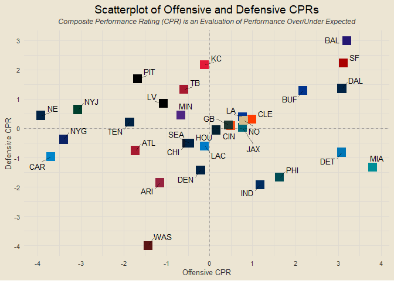

### Contents

- [Team Standings](#team-standings)
- [Offensive and Defensive PPG](#offensive-and-defensive-ppg)
- [Offensive and Defensive YPG](#offensive-and-defensive-ypg)
- [Team Margins](#team-margins)
- [Point-Adjusted Margins](#point-adjusted-margins)
- [Quarter-Based Scoring Trends](#quarter-based-scoring-trends)
- [Offensive and Defensive CPR](#offensive-and-defensive-cpr)
- [Modeling](#modeling)

------------------------------------------------------------------------

### Team Standings

<!-- -->

------------------------------------------------------------------------

### Offensive and Defensive PPG

<!-- -->

------------------------------------------------------------------------

### Offensive and Defensive YPG

<!-- -->

------------------------------------------------------------------------

### Team Margins

<!-- -->

------------------------------------------------------------------------

### Point-Adjusted Margins

<!-- -->

------------------------------------------------------------------------

### Quarter-Based Scoring Trends

<!-- -->

------------------------------------------------------------------------

### Offensive and Defensive CPR

<!-- -->

##### Five Best Total CPRs

1.  BUF: 8.375
2.  BAL: 4.688
3.  KC: 4.625
4.  MIA: 4.604
5.  DAL: 4.167

##### Five Worst Total CPRs

1.  DEN: -9.52
2.  CHI: -7.104
3.  LV: -5.499
4.  CAR: -5.48
5.  NYG: -3.555

------------------------------------------------------------------------

### Modeling

First draft basic logistic regression accuracy: 79.66%

##### *This Week’s Predictions*

- SEA @ NYG: SEA def. NYG (1)
- DEN @ CHI: DEN def. CHI (0.998)
- MIA @ BUF: BUF def. MIA (0.954)
- CIN @ TEN: TEN def. CIN (0.929)
- ARI @ SF: SF def. ARI (0.908)
- PIT @ HOU: HOU def. PIT (0.894)
- WAS @ PHI: PHI def. WAS (0.885)
- ATL @ JAX: JAX def. ATL (0.781)
- NE @ DAL: NE def. DAL (0.768)
- BAL @ CLE: BAL def. CLE (0.763)
- MIN @ CAR: MIN def. CAR (0.753)
- LA @ IND: LA def. IND (0.728)
- DET @ GB: DET def. GB (0.72)
- LV @ LAC: LAC def. LV (0.67)
- TB @ NO: NO def. TB (0.659)
- KC @ NYJ: KC def. NYJ (0.554)

``` r
# Install and load the XGBoost package
# install.packages("xgboost")
library(xgboost)
```

    ## 
    ## Attaching package: 'xgboost'

    ## The following object is masked from 'package:dplyr':
    ## 
    ##     slice

``` r
# Prepare your data
dtrain <- xgb.DMatrix(data = as.matrix(modeling_df[, c("home_pam", "home_avg_margin", "home_ppg",
                                                       "home_papg", "away_pam", "away_avg_margin",
                                                       "away_ppg", "away_papg")]),
                      label = modeling_df$home_win)

# Define hyperparameters
params <- list(
  objective = "binary:logistic",  # Binary classification
  eval_metric = "logloss"         # Log loss as evaluation metric
)

# Train the XGBoost model
xgb_model <- xgboost(data = dtrain, params = params, nrounds = 100)
```

    ## [1]  train-logloss:0.568041 
    ## [2]  train-logloss:0.504870 
    ## [3]  train-logloss:0.459962 
    ## [4]  train-logloss:0.408317 
    ## [5]  train-logloss:0.381884 
    ## [6]  train-logloss:0.342633 
    ## [7]  train-logloss:0.313599 
    ## [8]  train-logloss:0.291712 
    ## [9]  train-logloss:0.280256 
    ## [10] train-logloss:0.271557 
    ## [11] train-logloss:0.253464 
    ## [12] train-logloss:0.240507 
    ## [13] train-logloss:0.232846 
    ## [14] train-logloss:0.222971 
    ## [15] train-logloss:0.216754 
    ## [16] train-logloss:0.211281 
    ## [17] train-logloss:0.202547 
    ## [18] train-logloss:0.195860 
    ## [19] train-logloss:0.182951 
    ## [20] train-logloss:0.176757 
    ## [21] train-logloss:0.171624 
    ## [22] train-logloss:0.167598 
    ## [23] train-logloss:0.165668 
    ## [24] train-logloss:0.161208 
    ## [25] train-logloss:0.158501 
    ## [26] train-logloss:0.153487 
    ## [27] train-logloss:0.150916 
    ## [28] train-logloss:0.148533 
    ## [29] train-logloss:0.146146 
    ## [30] train-logloss:0.143633 
    ## [31] train-logloss:0.142338 
    ## [32] train-logloss:0.139197 
    ## [33] train-logloss:0.137245 
    ## [34] train-logloss:0.135869 
    ## [35] train-logloss:0.134133 
    ## [36] train-logloss:0.131021 
    ## [37] train-logloss:0.129787 
    ## [38] train-logloss:0.128463 
    ## [39] train-logloss:0.126838 
    ## [40] train-logloss:0.124179 
    ## [41] train-logloss:0.123053 
    ## [42] train-logloss:0.121752 
    ## [43] train-logloss:0.120700 
    ## [44] train-logloss:0.118548 
    ## [45] train-logloss:0.117443 
    ## [46] train-logloss:0.116276 
    ## [47] train-logloss:0.115064 
    ## [48] train-logloss:0.114142 
    ## [49] train-logloss:0.113148 
    ## [50] train-logloss:0.111892 
    ## [51] train-logloss:0.110034 
    ## [52] train-logloss:0.109145 
    ## [53] train-logloss:0.108453 
    ## [54] train-logloss:0.107947 
    ## [55] train-logloss:0.107111 
    ## [56] train-logloss:0.106367 
    ## [57] train-logloss:0.105844 
    ## [58] train-logloss:0.105160 
    ## [59] train-logloss:0.104377 
    ## [60] train-logloss:0.103536 
    ## [61] train-logloss:0.102858 
    ## [62] train-logloss:0.102101 
    ## [63] train-logloss:0.101435 
    ## [64] train-logloss:0.100872 
    ## [65] train-logloss:0.100222 
    ## [66] train-logloss:0.099738 
    ## [67] train-logloss:0.099168 
    ## [68] train-logloss:0.098599 
    ## [69] train-logloss:0.097914 
    ## [70] train-logloss:0.097335 
    ## [71] train-logloss:0.096623 
    ## [72] train-logloss:0.096057 
    ## [73] train-logloss:0.095549 
    ## [74] train-logloss:0.095043 
    ## [75] train-logloss:0.094317 
    ## [76] train-logloss:0.093859 
    ## [77] train-logloss:0.093296 
    ## [78] train-logloss:0.092766 
    ## [79] train-logloss:0.092418 
    ## [80] train-logloss:0.091981 
    ## [81] train-logloss:0.091442 
    ## [82] train-logloss:0.091149 
    ## [83] train-logloss:0.090685 
    ## [84] train-logloss:0.090426 
    ## [85] train-logloss:0.089947 
    ## [86] train-logloss:0.089521 
    ## [87] train-logloss:0.089081 
    ## [88] train-logloss:0.088888 
    ## [89] train-logloss:0.088491 
    ## [90] train-logloss:0.088225 
    ## [91] train-logloss:0.087946 
    ## [92] train-logloss:0.087583 
    ## [93] train-logloss:0.087148 
    ## [94] train-logloss:0.086818 
    ## [95] train-logloss:0.086590 
    ## [96] train-logloss:0.086023 
    ## [97] train-logloss:0.085773 
    ## [98] train-logloss:0.085523 
    ## [99] train-logloss:0.085321 
    ## [100]    train-logloss:0.084993

``` r
# Make predictions
# Assuming you have a new dataset called new_data
dtest <- xgb.DMatrix(data = as.matrix(modeling_df[, c("home_pam", "home_avg_margin", "home_ppg", "home_papg", "away_pam", "away_avg_margin", "away_ppg", "away_papg")]))
predictions <- predict(xgb_model, dtest)

# Evaluate the model as needed
modeling_df |>
  select(home_win) |>
  mutate(pred_prob = predictions,
         pred_hw = ifelse(pred_prob >= 0.5, 1, 0)) |>
  count(home_win == pred_hw)
```

    ## # A tibble: 1 × 2
    ##   `home_win == pred_hw`     n
    ##   <lgl>                 <int>
    ## 1 TRUE                     59
