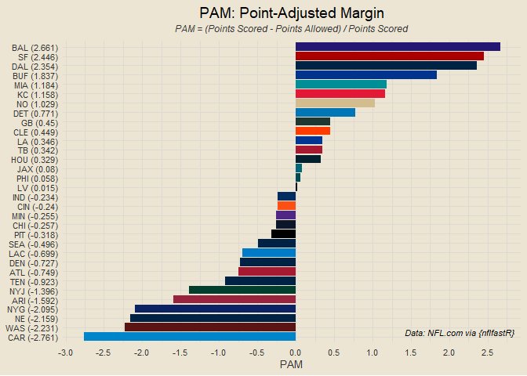

### Contents

- [Team Standings](#team-standings)
- [Offensive and Defensive PPG](#offensive-and-defensive-ppg)
- [Offensive and Defensive YPG](#offensive-and-defensive-ypg)
- [Team Margins](#team-margins)
- [Point-Adjusted Margins](#point-adjusted-margins)
- [Quarter-Based Scoring Trends](#quarter-based-scoring-trends)
- [Offensive and Defensive CPR](#offensive-and-defensive-cpr)
- [Weekly QB CER](#weekly-qb-cer)
- [Modeling](#modeling)

------------------------------------------------------------------------

### Team Standings

<!-- -->

------------------------------------------------------------------------

### Offensive and Defensive PPG

<!-- -->

------------------------------------------------------------------------

### Offensive and Defensive YPG

<!-- -->

------------------------------------------------------------------------

### Team Margins

<!-- -->

------------------------------------------------------------------------

### Point-Adjusted Margins

<!-- -->

------------------------------------------------------------------------

### Quarter-Based Scoring Trends

<!-- -->

------------------------------------------------------------------------

### Offensive and Defensive CPR

<!-- -->

##### Five Best Total CPRs

1.  BUF: 8.594
2.  DAL: 5.563
3.  SF: 4.782
4.  BAL: 4.688
5.  DET: 4.437

##### Five Worst Total CPRs

1.  DEN: -9.406
2.  CHI: -7.406
3.  CAR: -4.813
4.  LV: -4.812
5.  NYG: -4.625

------------------------------------------------------------------------

### Weekly QB CER

<!-- -->

------------------------------------------------------------------------

### Modeling

First draft basic logistic regression accuracy: 78.12%

##### *This Week’s Predictions*

- NYJ @ DEN: NYJ def. DEN (0.991)
- JAX @ BUF: BUF def. JAX (0.987)
- NYG @ MIA: MIA def. NYG (0.965)
- CHI @ WAS: CHI def. WAS (0.824)
- CAR @ DET: DET def. CAR (0.817)
- GB @ LV: GB def. LV (0.817)
- BAL @ PIT: BAL def. PIT (0.795)
- DAL @ SF: SF def. DAL (0.795)
- KC @ MIN: KC def. MIN (0.738)
- PHI @ LA: PHI def. LA (0.727)
- NO @ NE: NE def. NO (0.559)
- HOU @ ATL: HOU def. ATL (0.527)
- CIN @ ARI: CIN def. ARI (0.522)
- TEN @ IND: TEN def. IND (0.519) <!-- - NA --> <!-- - NA -->
